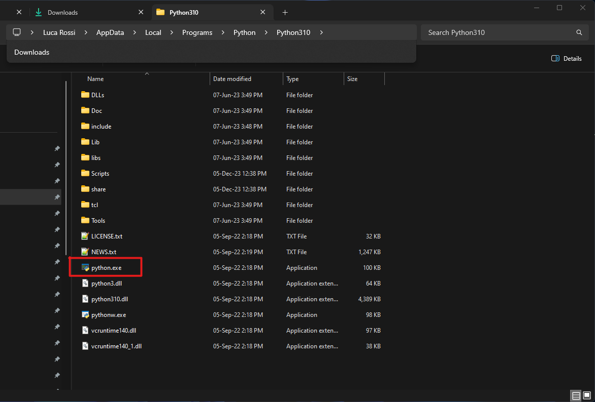

# Python wrapper

## Working with the wrapper
### Installation
Currently the Python wrapper of the e384commlib only works on Windows systems.

#### Windows
##### Requirements
- Python 3.11.7
- custom dlls:
    - You can download them from [here](https://elements-ic.com/wp-content/uploads/2024/02/python_3_11_7_dlls.zip)
- fw folder:
    - You can download it from [here](https://elements-ic.com/wp-content/uploads/2024/02/fw.zip)
    - currently the device firmware resides on the pc, hence to use the devices you'll have to unzip the fw zip and place it in a known path in order to use it on you scripts

> :warning: **The dlls must be used only with Python version 3.11.7**

This is the official python version supported, if you need to work with other python versions, please contact us.

Once installed locate the python interpreter, should be under the following path ```C:\Users\<User>\AppData\Local\Programs\Python311```

Open a **command prompt**.

Navigate to the folder you wish to install the calibrator to.

Now you need to use Python to create a **virtual environment** also called **venv**.

Be sure to use the right version of Python to create the virtual environment, for this reason go to the previously located path and copy the absolute path of the **python.exe** file like in the following image.



```
"abs/path/of/python.exe" -m venv .\
```
After the creation of the venv activate it by typing: ```Scripts\activate```

Now that the venv is active you need to install all the dependency from the requirements.txt using ```pip install -r path\to\requirements.txt``` then copy all the files from the previously downloaded **dlls** folder into the **Lib\site-packages** folder that has been created with the venv.

### Usage
The typical sequence of commands is:
- detectDevices
- connect
- configure: you can configure it in various way (sampling rate, current range ecc.)
- read data/run your experiment
- disconnect

To work with the cl384-python open the command prompt.

Activate the virtual environment with: ```Scripts\activate```

Run the script : ```python .\your_script.py```

To test that the installation has been successful, just run ```python example.py``` from within the directory and with the venv already active.
Please remember to change the fw path to the path in wich you previously unzipped it. 

#### A note on the example
The example only shows how to use some basic functionalities, you may need to do much more in your experiments.
In the e384commlib_python.cpp file you'll see a bunch of functions that may not be in the example but are already implemented, so that you can correctly and safely call them in your script.

## Add functionalities to the wrapper
The communication library offers a great variety of functionalities that have not been ported to python yet.
If you need one of these functions you can write yourself the wrapper function and compile the source code to make the library more complete using a c++ version greater or equal 14.
Unfortunately this procedure is still in early stages and we're still figuring out the best way to share the toolchain to build such wrappers.
